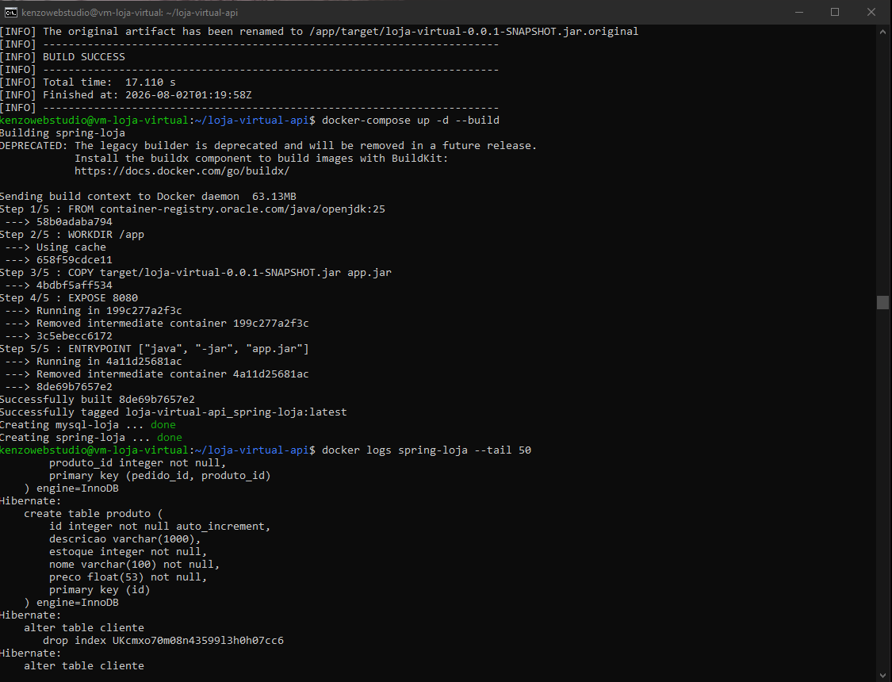
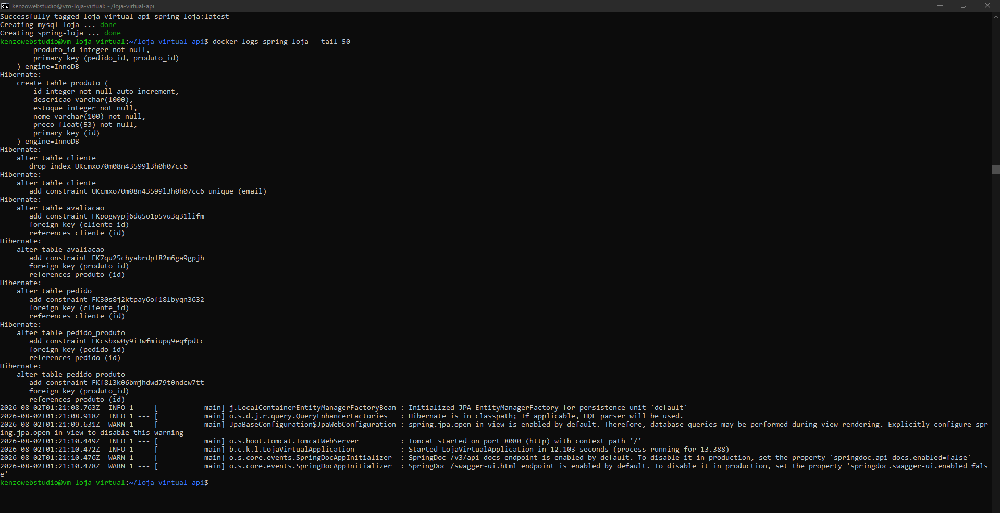
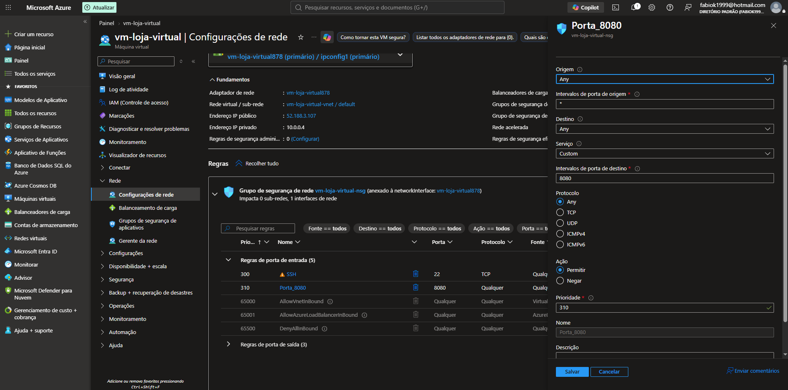
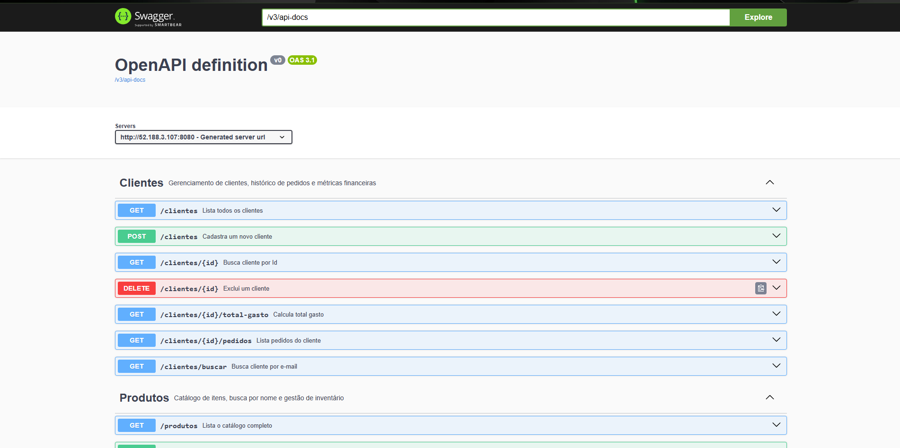
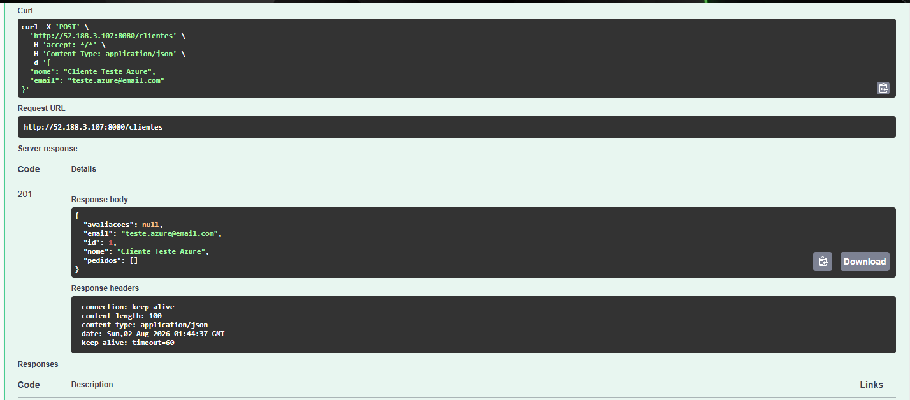

# 🛒 Loja Virtual API

Uma API RESTful desenvolvida em **Java** utilizando **Spring Boot**, criada para simular o backend de uma loja virtual. O projeto foi desenvolvido com foco em boas práticas de arquitetura, segurança, containerização e deploy em nuvem, proporcionando uma base sólida para aplicações escaláveis.

---

# 🚀 Tecnologias Utilizadas

- **Java 25**
- **Spring Boot 3**
- **Spring Data JPA**
- **Hibernate**
- **MySQL 8.4 LTS**
- **Docker**
- **Docker Compose**
- **Swagger / OpenAPI 3**
- **Maven**
- **Microsoft Azure (VM Linux Ubuntu)**

---

# 📌 Funcionalidades Implementadas

## 🏗️ Modelagem da Aplicação

- Desenvolvimento seguindo os princípios da Programação Orientada a Objetos (POO);
- Modelagem das entidades utilizando JPA/Hibernate;
- Relacionamentos entre entidades;
- Persistência de dados utilizando MySQL.

---

## ✅ Validação de Dados

Foram implementadas validações para garantir a integridade das informações recebidas pela API.

Exemplos:

- Campos obrigatórios;
- Validação de estoque;
- Validação de preços;
- Consistência dos dados persistidos.

---

## ⚠️ Tratamento Global de Exceções

A API possui um tratamento global de exceções utilizando:

- `@ControllerAdvice`
- `ResourceExceptionHandler`
- Classes personalizadas para respostas de erro

Com isso, a aplicação retorna mensagens padronizadas e amigáveis para o consumidor da API.

Exemplos de respostas tratadas:

- **400 Bad Request**
- **404 Not Found**
- **500 Internal Server Error**

---

# 🔐 Segurança

O projeto segue boas práticas inspiradas no conceito **12-Factor App**, mantendo informações sensíveis fora do código-fonte.

Entre elas:

- utilização de variáveis de ambiente;
- arquivo `application.properties.example`;
- credenciais protegidas através do `.gitignore`;
- nenhuma senha armazenada no repositório.

---

# 🐳 Docker

Toda a aplicação pode ser executada através do Docker.

Foram utilizados:

## Dockerfile

Responsável pela criação da imagem da aplicação Java.

## Docker Compose

Responsável por orquestrar:

- API Spring Boot;
- Banco MySQL.

Além disso, foram configurados:

- rede customizada (`bridge`);
- healthcheck do banco;
- dependência entre containers;
- variáveis de ambiente.

---

# 📖 Documentação da API

A aplicação possui documentação automática utilizando **Swagger/OpenAPI**.

Após iniciar o projeto, basta acessar:

```text
http://localhost:8080/swagger-ui/index.html
```

Lá é possível visualizar todos os endpoints e realizar testes diretamente pelo navegador.

---

# 🚀 Executando o Projeto

## 1️⃣ Clone o repositório

```bash
git clone https://github.com/FabioKenzo/loja-virtual-api.git

cd loja-virtual-api
```

---

## 2️⃣ Configure o arquivo de propriedades

Copie o arquivo de exemplo:

```bash
cp src/main/resources/application.properties.example src/main/resources/application.properties
```

No Windows, basta duplicar o arquivo:

```text
application.properties.example
```

e renomeá-lo para:

```text
application.properties
```

---

## 3️⃣ Execute os containers

```bash
docker compose up -d
```

O Docker irá automaticamente:

- baixar as imagens necessárias;
- criar a rede da aplicação;
- iniciar o banco MySQL;
- aguardar o banco ficar saudável;
- iniciar a API.

---

# ☁️ Deploy na Microsoft Azure

Este projeto também foi implantado em ambiente de nuvem utilizando a infraestrutura da **Microsoft Azure**, com o objetivo de validar o funcionamento da aplicação em um ambiente próximo ao de produção.

## 🏗️ Arquitetura Utilizada

- Máquina Virtual Linux Ubuntu;
- Docker;
- Docker Compose;
- Spring Boot;
- MySQL.

---

## ⚙️ Infraestrutura

A implantação foi realizada em uma **Azure Virtual Machine (VM)** utilizando containers Docker.

A infraestrutura foi composta por:

- VM Ubuntu;
- Docker Engine;
- Docker Compose;
- Spring Boot;
- MySQL;
- Network Security Group (NSG).

---

## 🌐 Configuração de Rede

Foi realizada a configuração das regras de entrada no **Network Security Group (NSG)** para permitir acesso externo à aplicação através da porta:

```text
8080
```

---

# 📸 Evidências do Deploy e Funcionamento

Abaixo estão algumas evidências do processo de implantação e validação da aplicação em ambiente de nuvem utilizando a Microsoft Azure.

---

## 1️⃣ Build da Aplicação e Criação das Imagens Docker



*Compilação do projeto utilizando Maven (Java 25) e criação das imagens Docker da aplicação.*

---

## 2️⃣ Inicialização dos Containers



*Containers da API e do MySQL em execução, com o Spring Boot inicializado e conectado corretamente ao banco de dados.*

---

## 3️⃣ Configuração do Firewall (Network Security Group)



*Configuração das regras de entrada no Network Security Group (NSG), permitindo acesso externo à aplicação pela porta **8080**.*

---

## 4️⃣ Documentação OpenAPI / Swagger



*Interface do Swagger disponível publicamente após o deploy da aplicação na máquina virtual da Microsoft Azure.*

---

## 5️⃣ Teste End-to-End e Persistência de Dados



*Execução do endpoint `POST /clientes`, retornando **HTTP 201 (Created)** e persistindo os dados com sucesso no banco MySQL hospedado na Azure.*

---

# 💰 FinOps

Após a conclusão dos testes e validação da infraestrutura, todos os recursos utilizados na Azure foram removidos através da exclusão do **Resource Group**.

Essa prática evita cobranças desnecessárias e demonstra preocupação com boas práticas de gerenciamento de custos em ambientes Cloud.

---

# 🎯 Objetivos do Projeto

Este projeto foi desenvolvido com o objetivo de aprofundar conhecimentos em:

- Java;
- Programação Orientada a Objetos;
- Spring Boot;
- Spring Data JPA;
- Hibernate;
- MySQL;
- Docker;
- Docker Compose;
- Swagger/OpenAPI;
- Deploy em Cloud;
- Microsoft Azure;
- DevOps;
- Infraestrutura como Código.

---

# 👨‍💻 Autor

**Fábio Kenzo Okamura**

Graduando em **Análise e Desenvolvimento de Sistemas** pela **UNITAU**.

Focado em:

- Desenvolvimento Backend Java;
- Spring Boot;
- APIs REST;
- Docker;
- DevOps;
- Cloud Computing.
